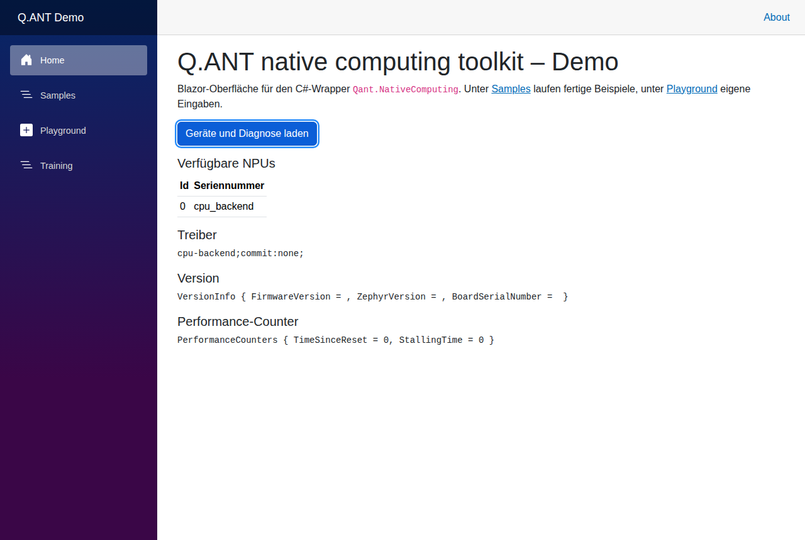
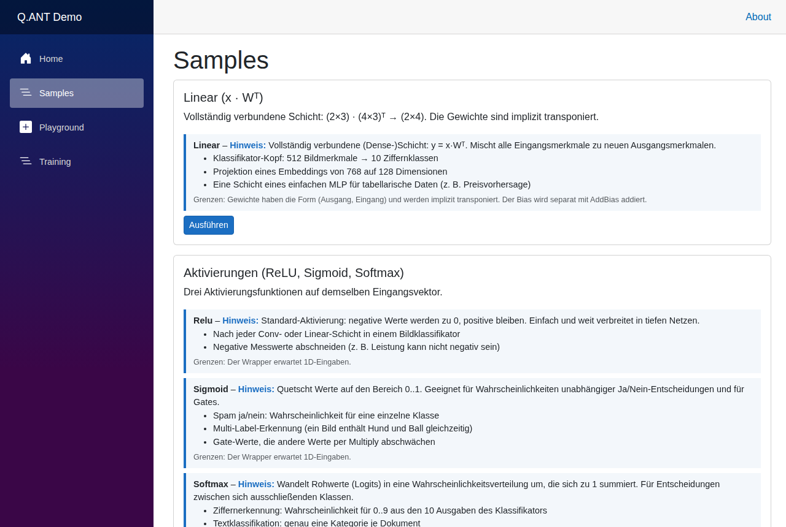
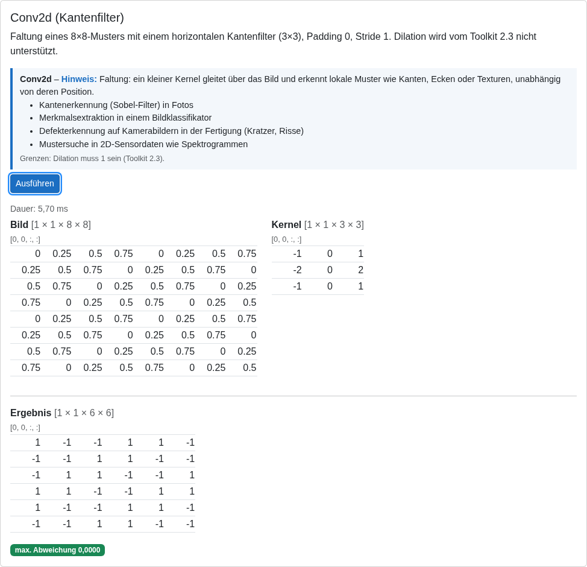
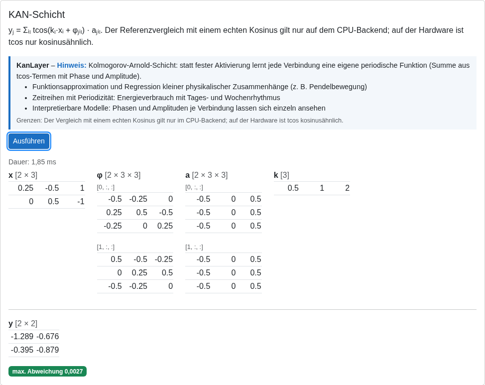
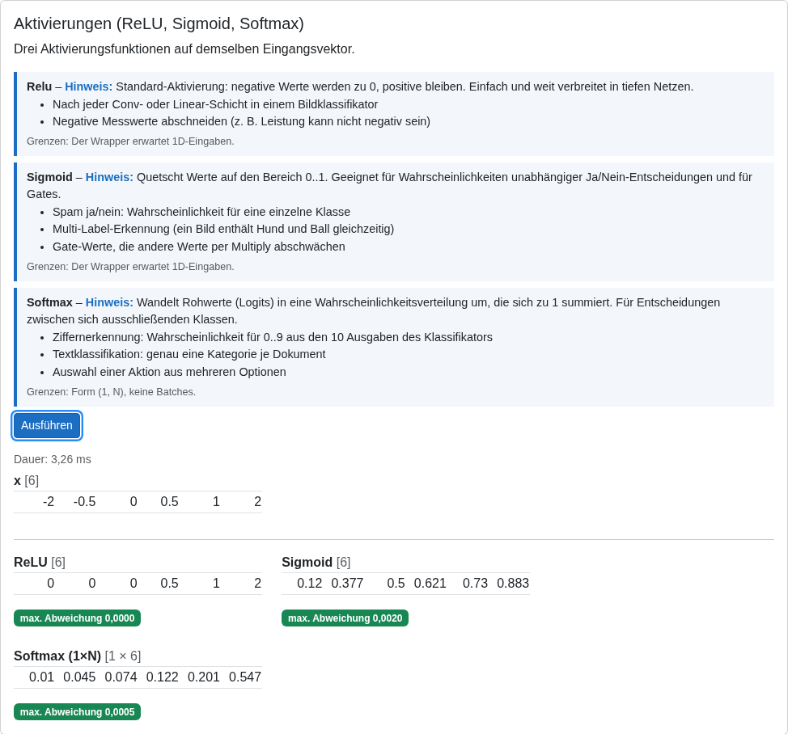
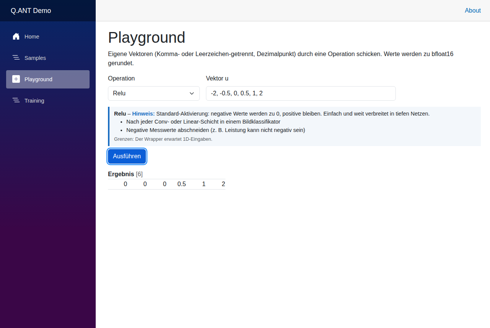
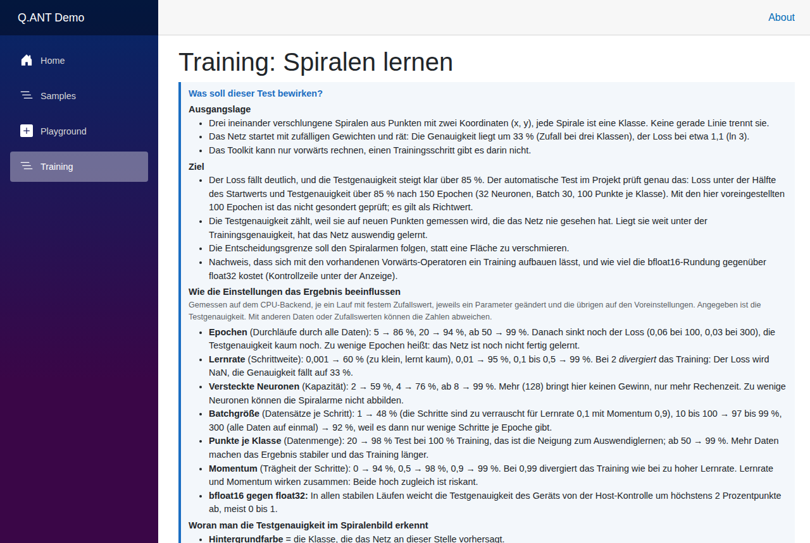
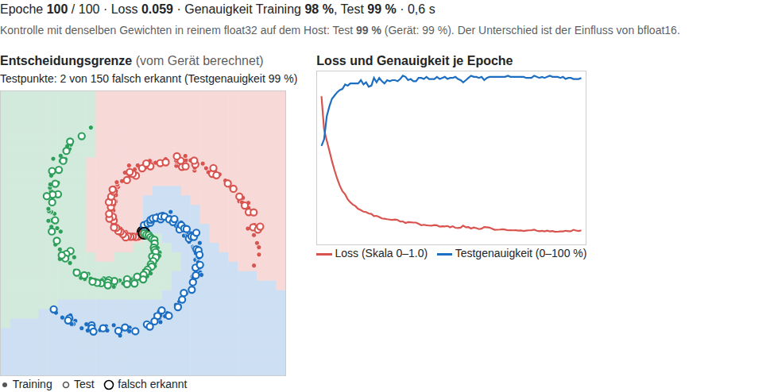

# Qant.NativeComputing (C#)

C#-Wrapper für das [Q.ANT native computing toolkit](https://github.com/Q-ANT-GmbH/qant_native_computing_toolkit) (C-API 2.3, DLPack 1.1) mit einer abstrahierten .NET-API, Tests und einer Blazor-Demo.

> **Hinweis:** Dies ist ein **inoffizieller** Wrapper und kein Produkt der Q.ANT GmbH. Er wird nicht von Q.ANT entwickelt, geprüft oder unterstützt. „Q.ANT“ wird hier nur beschreibend verwendet, um das Toolkit zu benennen, für das der Wrapper gedacht ist.
>
> - Das [Q.ANT native computing toolkit](https://github.com/Q-ANT-GmbH/qant_native_computing_toolkit) steht unter Apache-2.0. Es und seine Bibliothek gehören nicht zu diesem Repository; sie werden nur geladen.
> - Der **Treiber für die Q.ANT-Hardware** ist eine getrennte, proprietäre Komponente mit eigenen Bedingungen. Er liegt nicht in diesem Repository. Wer ihn nutzen will, braucht dafür eine Lizenz von Q.ANT.
> - Die Beispiele und Tests in diesem Repository laufen auf dem CPU-Backend des Toolkits, einer Simulation. Aussagen über Geschwindigkeit, Energiebedarf oder Genauigkeit der Hardware lassen sich daraus nicht ableiten.

- **16 Operationen** hinter einer Schnittstelle (`IQantDevice`): Linear, Conv2d, ConvTranspose2d, BatchNorm2d, Max-/Avg-/Adaptive-Pooling, ReLU, Sigmoid, Softmax, Bias, KAN-Schicht u. a., dazu Diagnose (Treiberinfo, Sensoren, Performance-Counter).
- **Eigene Typen** `BFloat16` und `Tensor` (row-major), Marshalling über DLPack ohne Kopie auf der Eingabeseite.
- **Getestet gegen das CPU-Backend** des Toolkits (44 Tests). Auf Q.ANT-Hardware wurde nichts getestet.

## Inhalt

- [Voraussetzung: native Bibliothek](#voraussetzung-native-bibliothek)
- [Schnellstart](#schnellstart)
- [Blazor-Demo](#blazor-demo) (mit Screenshots)
- [Aufbau des Projekts](#aufbau-des-projekts)
- [Tests](#tests)
- [Einschränkungen](#einschränkungen)
- [Dokumentation (ADRs)](#dokumentation-adrs)
- [Danksagung](#danksagung)
- [Lizenz](#lizenz)

## Voraussetzung: native Bibliothek

Der Wrapper braucht `libqant_native_computing_toolkit.so`. Zwei Varianten:

| Variante | Bezug |
| --- | --- |
| Mit Q.ANT-Hardware | Release-Paket des Toolkits (`.deb`) und installierter Treiber |
| Ohne Hardware (CPU-Backend) | Selbst bauen, siehe unten |

CPU-Backend selbst bauen (Rust 1.93 laut `rust-toolchain.toml`, `libclang` für bindgen):

```bash
git clone --recurse-submodules https://github.com/Q-ANT-GmbH/qant_native_computing_toolkit
cd qant_native_computing_toolkit
cargo build --release --no-default-features -F cpu-backend
cp target/release/libqant_native_computing_toolkit.so <dieses-repo>/native/
```

Die Bibliothek wird über den Standard-Suchpfad gefunden oder explizit über die Umgebungsvariable:

```bash
export QANT_NATIVE_LIB_PATH=$PWD/native/libqant_native_computing_toolkit.so
```

`native/*.so` ist nicht im Repository (Binärdatei, siehe `.gitignore`).

## Schnellstart

```csharp
using Qant.NativeComputing;

QantToolkit.SetupLogging("./logs", LogLevel.Info);
foreach (var npu in QantToolkit.GetAvailableDevices())
    Console.WriteLine($"{npu.Id}: {npu.SerialNumber}");

using IQantDevice dev = QantToolkit.OpenDevice(0);

var x = Tensor.FromArray(new float[,] { { 1, 2, 3 } });              // (batch, in)
var w = Tensor.FromArray(new float[,] { { 1, 0, 0 }, { 0, 1, 1 } }); // (out, in)
Tensor y = dev.Linear(x, w);                                          // x · wᵀ -> (1, 2)
Console.WriteLine(string.Join(", ", y.ToSingleArray()));              // 1, 5
```

Alle Tensoren sind bfloat16. Werte aus float32 werden gerundet, deshalb vergleichen die Tests mit Toleranzen.

## Blazor-Demo

`samples/Qant.BlazorDemo` ist eine Blazor-Server-Anwendung (net10.0), mit der sich alle Operationen ausprobieren lassen.

**Starten**

- VS Code: Debug-Profil **„Qant Blazor Demo (CPU-Backend)“** (öffnet `http://localhost:5080`), oder
- Kommandozeile:

```bash
QANT_NATIVE_LIB_PATH=$PWD/native/libqant_native_computing_toolkit.so \
  dotnet run --project samples/Qant.BlazorDemo
```

Der Library-Pfad lässt sich auch über `Qant:LibraryPath` in `appsettings.json` setzen. Ohne Library zeigt die Demo einen Hinweis mit dem erwarteten Pfad.

### Home: Geräte und Diagnose

Listet die verfügbaren NPUs und zeigt Treiberinfo, Version und Performance-Counter. Auf dem CPU-Backend heißt das Gerät `cpu_backend`.



### Samples

Zehn fertige Beispiele (Linear, Aktivierungen, Conv2d, Pooling, BatchNorm2d, Bias, ConvTranspose2d, Adaptive Pooling, elementweise Operationen, KAN-Schicht). Zu jeder Operation gibt es einen Hinweis mit Eignung, realen Beispielen und den Grenzen des Toolkits. Jedes Ergebnis wird gegen eine einfache C#-Referenz verglichen und zeigt die maximale Abweichung.



Faltung eines 8×8-Musters mit einem Kantenfilter, Ergebnis stimmt mit der Referenz überein:



KAN-Schicht. Der Referenzvergleich mit einem echten Kosinus gilt nur auf dem CPU-Backend, auf der Hardware ist `tcos` nur kosinusähnlich:



ReLU, Sigmoid und Softmax auf demselben Eingangsvektor:



### Playground

Eigene Vektoren durch ReLU, Sigmoid, Softmax, Multiply oder die skalierte periodische Nichtlinearität schicken.



### Training: Spiralen lernen

Das Toolkit kann nur vorwärts rechnen (`*_fprop`). Das Beispiel zeigt, wie sich trotzdem ein kleines Netz trainieren lässt:

- **Vorwärts auf dem Gerät:** `Linear`, `AddBias`, `Relu`, `Softmax` (je Datensatz, das Toolkit erlaubt nur die Form 1×N).
- **Rückwärts in C#:** Die Matrixprodukte der Gradienten laufen wieder über `Linear` mit transponierten Argumenten, die ReLU-Ableitung über `Multiply`. Loss, Bias-Gradienten und Optimizer (SGD mit Momentum) rechnet der Host.
- **Gewichte** liegen als float32 auf dem Host, das Gerät sieht sie auf bfloat16 gerundet.

Die Seite erklärt Ausgangslage und Ziel, den Einfluss der Parameter (gemessen auf dem CPU-Backend) und wie man die Testgenauigkeit im Bild abliest.



Ergebnis nach 100 Epochen mit den Voreinstellungen: Der Hintergrund zeigt die vom Gerät vorhergesagten Klassen, gefüllte Punkte sind Trainingsdaten, hohle Kreise Testdaten, schwarze Ringe markieren falsch erkannte Testpunkte (hier 2 von 150, beide in der Bildmitte, wo die Spiralarme am dichtesten liegen):



Die Zahlen gelten für dieses Beispiel auf dem CPU-Backend. Ob sich das Training auf der Hardware (Rauschen, andere Nichtlinearität) genauso verhält, ist nicht geprüft.

## Aufbau des Projekts

```
src/Qant.NativeComputing/       Bibliothek
  IQantDevice.cs                abstrakte Schnittstelle (mockbar)
  QantDevice.cs                 Implementierung über P/Invoke
  QantToolkit.cs                Logging, Geräteerkennung, OpenDevice
  Tensor.cs, BFloat16.cs        verwaltete Typen
  Models.cs                     ConvOptions, PoolOptions, SensorInfo, QantException ...
  Native/                       interne P/Invoke- und DLPack-Structs
tests/Qant.NativeComputing.Tests/  xUnit-Tests (Unit, Integration, Referenz, Training)
samples/Qant.Sample/            Konsolen-Beispiel
samples/Qant.BlazorDemo/        Blazor-Demo (Samples, Playground, Training)
docs/adr/                       Architekturentscheidungen (ADR-0001 bis 0007)
docs/features/                  Implementierungspläne zu den ADRs
docs/adr-management/            ADR-Manager (CLI/GUI)
native/                         lokale Toolkit-Bibliothek (nicht im Repository)
```

## Tests

```bash
dotnet test                    # ohne Bibliothek: nur die verwalteten Tests laufen, der Rest wird übersprungen
./run-integration-tests.sh     # alle Tests gegen native/libqant_native_computing_toolkit.so
```

Die Integrationstests vergleichen Conv2d, ConvTranspose2d, BatchNorm2d und die KAN-Schicht mit einfachen C#-Referenzen, prüfen alle Demo-Samples und das Training (Gradienten gegen numerische Gradienten, Lerntest auf den Spiralen).

## Einschränkungen

- **Nur CPU-Backend getestet.** Das Backend ist eine einfache Simulation; `tcos` ist dort ein echter Kosinus.
- **Toolkit 2.3 unterstützt nicht:** Dilation ≠ 1 (Conv, ConvTranspose), `output_padding` ≠ 0 (ConvTranspose), Batchgröße > 1 bei ConvTranspose und BatchNorm2d, Batches bei Softmax (nur Form 1×N), adaptives Pooling nur bei ganzzahligem Größenverhältnis.
- **Nicht gewrappt:** die als deprecated markierten `mul_npu_f32` und `mul_npu_i16`.
- **Nicht getestet:** Sensor- und Versionsinfo.
- Native Fehlerursachen stehen nicht in der `QantException`; `QantToolkit.SetupLogging` einschalten (auf dem CPU-Backend meldet es selbst einen Fehler).

## Dokumentation (ADRs)

Die Entscheidungen stehen als ADRs in [`docs/adr/`](docs/adr), die zugehörigen Pläne in [`docs/features/`](docs/features):

| ADR | Thema |
| --- | --- |
| 0001 | Toolkit-C-API per P/Invoke wrappen |
| 0002 | DLPack-Structs von Hand spiegeln, Tensor-Eigentum explizit regeln |
| 0003 | Gerät hinter `IQantDevice` abstrahieren |
| 0004 | Eigene Typen `BFloat16` und `Tensor` |
| 0005 | Fehlerbehandlung: früh validieren, typisierte Exceptions |
| 0006 | Auflösung der nativen Bibliothek |
| 0007 | Teststrategie: Unit-Tests plus CPU-Backend-Integrationstests |

Die ADRs wurden nachträglich geschrieben. Den Status `Full Acceptance (Final)` haben sie auf Anweisung des Projektinhabers erhalten, ohne dass Security- und Compliance-Review durchgeführt wurden (siehe Prüfnachweise in den Plänen). Das Trainingsbeispiel hat kein eigenes ADR.

## Danksagung

Ein herzlicher Dank an die **Q.ANT GmbH** für die Forschung und Entwicklung photonischer Prozessoren für KI. Mit ihnen soll KI-Rechnen energieeffizienter und leistungsfähiger werden als auf herkömmlichen NPUs. Dass das zugehörige Toolkit offen unter Apache-2.0 verfügbar ist, hat diesen Wrapper erst möglich gemacht. Ob und in welchem Maß die Hardware diesen Anspruch einlöst, haben wir mit diesem Repository nicht gemessen.

## Lizenz

Apache License 2.0, siehe [LICENSE](LICENSE) (unveränderter Standardtext). Das Q.ANT native computing toolkit selbst steht ebenfalls unter Apache-2.0 und gehört nicht zu diesem Repository; die Bibliothek wird nur geladen.
