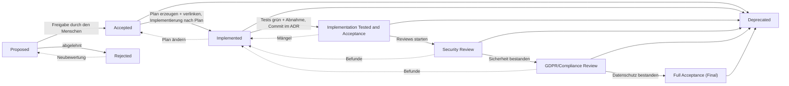

# Ablauf: ADR und Implementierung

Dieselbe Darstellung zeigt der ADR-Manager über die Schaltfläche **Ablauf** (das aktuell gewählte ADR ist hervorgehoben).

| Status | Bedeutung | Voraussetzung / Artefakt |
| --- | --- | --- |
| Proposed | Entwurf, noch nicht entschieden | ADR ausgefüllt, keine Feinplanung |
| Accepted | Entscheidung freigegeben (Mensch) | **Implementierungsplan** in `docs/features`, im ADR als `**Implementierungsplan:**` verlinkt |
| Implemented | Umsetzung nach Plan abgeschlossen | Code gemerged/committet, Umsetzungsstand im Plan fortgeschrieben |
| Implementation Tested and Acceptance | Tests und Abnahme erfolgt | Tests grün, Abnahme durch den Projektinhaber im Plan vermerkt, **Implementierungs-Commit im ADR** (`**Commit:**`) |
| Security Review | Sicherheitsprüfung (Skill `it-security`) | Befunde als Nacharbeit; Nachweis im Plan |
| GDPR/Compliance Review | Datenschutz-/Compliance-Prüfung (Skill `it-compliance`) | Datenflüsse, Rechtsgrundlage, Lizenzen; Nachweis im Plan |
| Full Acceptance (Final) | Endabnahme, alle Prüfungen bestanden | Entscheidung des Menschen |
| Rejected / Deprecated | verworfen / abgelöst | |

Regeln (vom ADR-Manager erzwungen): Statuswechsel nur gemäß Diagramm; ab `Accepted` muss der Plan verlinkt sein, ab `Implementation Tested and Acceptance` zusätzlich der Implementierungs-Commit (beim Speichern bzw. mit `--set-status` wird ein Plan-Gerüst angelegt, falls er fehlt). Beispiel-ADRs (Nr. ≥ 900000) sind ausgenommen. Prüfung: `docs/adr-management/start.sh --check`.
